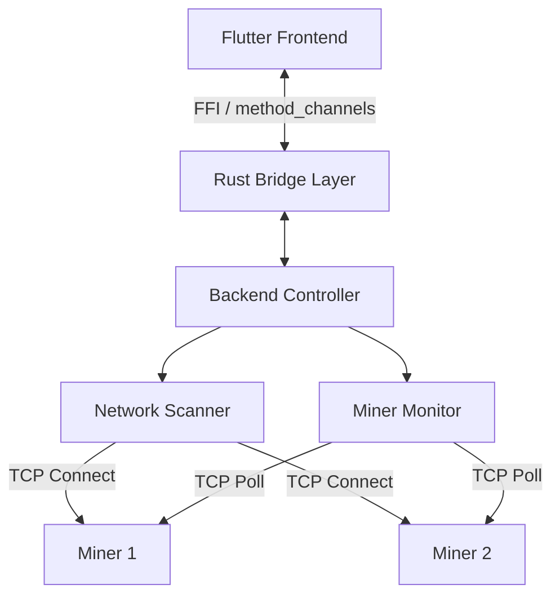

# Technical Design Document: "Bit-Link" Miner Manager

## 1. Architecture Overview

The system follows a split architecture to leverage the best of both worlds: **Rust** for high-performance, concurrent backend logic, and **Flutter** for a distinct, reactive cross-platform UI.

### High-Level Diagram


## 2. Technology Stack

### Backend (The "Engine")
*   **Language:** Rust (Edition 2021)
*   **Async Runtime:** `tokio` (for non-blocking I/O and scheduling)
*   **Serialization:** `serde` + `serde_json` (for parsing CGMiner RPC responses)
*   **Interoperability:** `flutter_rust_bridge` (v2 recommended) for type-safe, zero-copy communication with Flutter.

### Frontend (The "Cockpit")
*   **Framework:** Flutter (MacOS/Windows/Linux)
*   **State Management:** Riverpod (via generated FFI bindings)
*   **Key Widgets:**
    *   `MinerListView` - DataTable with sortable columns
    *   `ScannerControlPanel` - IP range input and scan trigger
    *   `MinerDetailDialog` - Expanded view for individual miner
    *   `BatchActionBar` - Multi-select actions (reboot, blink)
*   **Responsive Design:** Adaptive layout for desktop window resizing (minimum 1024x768)

## 3. Rust Module Design

The Rust codebase is organized into distinct modules. For full implementation details, refer to the source code links.

### 3.1 `core`
**Responsibility:** Shared data models and domain types used across the application.

**Key Types:**
*   **`Miner`** ([src/core/mod.rs](../src/core/mod.rs)): Represents a mining device.
    *   Input: IP address, discovery metadata.
    *   Output: Aggregated device state (model, stats, status).
*   **`MinerStats`**: Real-time metrics (hashrate, temps, fans, uptime).
*   **`MinerStatus`**: logic for health classification.
    *   `Active`: Responding + temp < 85°C + hashrate > 90% expected.
    *   `Warning`: Use for degraded performance.
    *   `Dead`: Connection timeout.
    *   `Scanning`: Discovery phase.

### 3.2 `scanner`
**Responsibility:** Network device discovery.

**Behavior:**
*   **Input:** IP Range (CIDR or Start-End).
*   **Logic:** Spawns lightweight `tokio::task`s for each IP to attempt TCP handshake on port 4028.
*   **Concurrency:** Uses a semaphore to limit concurrent open file descriptors (batch processing).
*   **Output:** Stream of found devices.

**Source:** [src/scanner/mod.rs](../src/scanner/mod.rs)

### 3.3 `client` (Miner Communication)
**Responsibility:** Encapsulates the CGMiner / BMiner API protocol.

**Interface Contract (Trait):**
The `MinerClient` trait defines the standard operations for any miner model.

```rust
#[async_trait]
pub trait MinerClient {
    /// Fetch current metrics (hashrate, temps, etc.)
    async fn get_summary(&self) -> Result<MinerStats, Error>;
    
    /// Restart the device
    async fn reboot(&self) -> Result<(), Error>;
    
    /// Identify device physically
    async fn blink_led(&self) -> Result<(), Error>;
}
```

**Source:** [src/client/mod.rs](../src/client/mod.rs)

### 3.4 `monitor`
**Responsibility:** Manages the lifecycle of known miners.

**Behavior:**
*   **Loop:** Maintains a list of active IPs and polls them at a configurable interval.
*   **State:** Holds a concurrent hash map (`DashMap`) of the latest miner states.
*   **Broadcasting:** Pushes state updates/diffs to the UI via the bridge.

**Source:** [src/monitor/mod.rs](../src/monitor/mod.rs)

## 4. CGMiner API Protocol Detail

Communication is done by sending a JSON payload over a raw TCP socket.

**Request Format:** `{"command": "summary", "parameter": ""}`

**Response Contract:**
Miners return a JSON object with a `STATUS` array and a data array (e.g., `SUMMARY`).
*   **Edge Cases:** Antminer vs Whatsminer key differences ("MHS av" vs "HS 5s"), non-standard ports (4029/4030).

## 5. Interface Layer (Flutter Bridge)

We use `flutter_rust_bridge` to generate binding code. These functions define the **API boundary** between the UI and the Rust backend.

### Exposed Functions (Rust -> Dart)

1.  **`start_scan`**
    *   **Input:** `ip_range: String` (CIDR or "start-end")
    *   **Output:** `Stream<ScanEvent>`
    *   **Events:** `Found(Miner)`, `Progress(f32)`, `Complete`

2.  **`subscribe_to_updates`**
    *   **Input:** None
    *   **Output:** `Stream<Vec<Miner>>` (Full state or diffs of the miner table)

3.  **`execute_command`**
    *   **Input:** `target_ips: Vec<String>`, `command: MinerCommand`
    *   **Output:** `Result<()>` (Batches commands like Reboot or LED Blink)

## 6. Implementation Strategy

1.  **Basic TCP Client:** Implement `client` module to handshake and parse JSON.
2.  **The Scanner:** Implement `scanner` with `tokio::spawn` and timeouts.
3.  **State Management:** Implement `monitor` loop (poll, update, broadcast).
4.  **Integration:** Wire up `flutter_rust_bridge` to run Rust logic from Flutter.

## 7. Performance Considerations

*   **Socket Limits:** Scanner must respect `ulimit -n` (batch requests).
*   **Parsing Overhead:** Use `serde_json::from_slice` for efficiency.
*   **Target:** Scan 254 IPs in <10s (Requires ~100 concurrent connections).

## 8. Error Handling Strategy

**Error Categories:**
*   **Timeout:** Connection unavailable.
*   **ParseError:** Invalid JSON from miner.
*   **NetworkError:** IO failures.
*   **Authentication:** 401/403 errors (S19+ models).

**Propagation:**
*   **Rust → Flutter:** Errors are serialized as structured data via FFI.
*   **UI:** Toast notifications for transient errors, dialogs for critical failures.

## 9. Configuration Management

**Key Configuration Parameters:**
*   **Network:** `scan_timeout_ms` (Default: 1500ms), `max_concurrent_scans` (Default: 100).
*   **Monitoring:** `poll_interval_ms` (Default: 10s), `retry_attempts`.
*   **Thresholds:** `warning_temp_threshold` (85°C), `warning_hashrate_ratio` (90%).

**Storage:** User preferences saved to `~/.bitlink/config.json`.

## 10. Observability & Debugging

*   **Logging:** `tracing` crate (ERROR, WARN, INFO, DEBUG).
*   **Metrics:** Scan duration, active connections, success rates exposed via FFI.

## 11. Testing Strategy

*   **Unit Tests:** Mock TCP responses for `client` and `scanner`.
*   **Integration Tests:** End-to-end scan against mock miner servers.
*   **Manual Testing:** `docker-compose` virtual network with simulated miners.

## 12. Future Enhancements

*   **Data Persistence:** SQLite for historical trends.
*   **Alerts:** Desktop notifications.
*   **Bulk Config:** Pool configuration updates.
*   **Remote Access:** WebSocket control.
