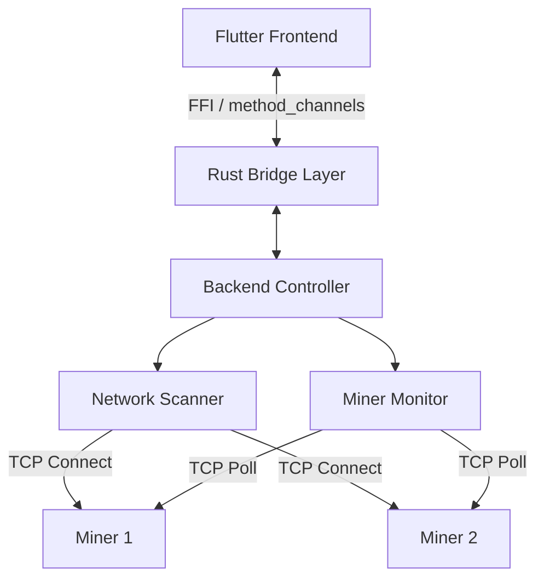

# Technical Design Document: "Bit-Link" Miner Manager

## 1. Architecture Overview

The system follows a split architecture to leverage the best of both worlds: **Rust** for high-performance, concurrent backend logic, and **Flutter** for a distinct, reactive cross-platform UI.

### High-Level Diagram


## 2. Technology Stack

### Backend (The "Engine")
*   **Language:** Rust (Edition 2021)
*   **Async Runtime:** `tokio` (for non-blocking I/O and scheduling)
*   **Serialization:** `serde` + `serde_json` (for parsing CGMiner RPC responses)
*   **Interoperability:** `flutter_rust_bridge` (v2 recommended) for type-safe, zero-copy communication with Flutter.

### Frontend (The "Cockpit")
*   **Framework:** Flutter (MacOS/Windows/Linux)
*   **State Management:** Riverpod (via generated FFI bindings)
*   **Key Widgets:**
    *   `MinerListView` - DataTable with sortable columns
    *   `ScannerControlPanel` - IP range input and scan trigger
    *   `MinerDetailDialog` - Expanded view for individual miner
    *   `BatchActionBar` - Multi-select actions (reboot, blink)
*   **Responsive Design:** Adaptive layout for desktop window resizing (minimum 1024x768)

## 3. Rust Module Design

The Rust codebase will be organized into the following distinct modules:

### 3.1 `core`
Contains shared data models and types used across the application.

**Key Structs:**
```rust
#[derive(Debug, Clone, Serialize, Deserialize)]
pub struct Miner {
    pub ip: String,
    pub model: Option<String>,
    pub status: MinerStatus,
    pub stats: MinerStats,
    pub last_updated: u64,
}

#[derive(Debug, Clone, Serialize, Deserialize)]
pub struct MinerStats {
    pub hashrate_rt: f64,
    pub hashrate_avg: f64,
    pub temperature_chip: Vec<f64>,
    pub temperature_pcb: Vec<f64>,
    pub fan_speeds: Vec<u32>,
    pub uptime: u64,
}

#[derive(Debug, Clone, PartialEq, Serialize, Deserialize)]
pub enum MinerStatus {
    Active,
    Warning, // e.g., high temp/low hash
    Dead,
    Scanning,
}

// Status determination logic:
// - Active: Responding + temp < 85°C + hashrate > 90% of expected
// - Warning: Responding but temp >= 85°C OR hashrate < 90%
// - Dead: Connection timeout or no response
// - Scanning: Initial discovery phase
```

### 3.2 `scanner`
Responsible for discovering devices on the network.

*   **Logic:**
    *   Takes an IP Range (CIDR or Start-End).
    *   Spawns lightweight `tokio::task`s for each IP.
    *   Attempts a TCP handshake on port `4028` (default CGMiner port).
    *   If successful, attempts a simple `get_version` or `summary` command to identify the device.
*   **Concurrency:** Uses a semaphore (e.g., `tokio::sync::Semaphore`) to limit concurrent open file descriptors (sockets) to avoid OS limits (e.g., batch 500 tasks at a time).

### 3.3 `client` (Miner Communication)
Encapsulates the CGMiner / BMiner API protocol.

*   **Transport:** TCP Stream.
*   **Protocol:** JSON-RPC over raw sockets.
*   **Trait Definition:**
    ```rust
    #[async_trait]
    pub trait MinerClient {
        async fn get_summary(&self) -> Result<MinerStats, Error>;
        async fn reboot(&self) -> Result<(), Error>;
        async fn blink_led(&self) -> Result<(), Error>;
    }
    ```

### 3.4 `monitor`
Manages the lifecycle of known miners.

*   **Loop:** Maintains a list of active IPs and polls them at a configurable interval (e.g., every 5s or 10s).
*   **State:** Holds a `DashMap<String, Miner>` (concurrent hash map) to store the latest state of all miners.
*   **Broadcasting:** Pushes updates to the UI via a StreamSink provided by the bridge interaction.

## 4. CGMiner API Protocol Detail

Communication is done by sending a JSON payload over a raw TCP socket, reading the response, and closing the socket (unless using keep-alive, though miners often prefer short-lived connections).

**Request Format:**
```json
{"command": "summary", "parameter": ""}
```

**Response Format:**
```json
{
    "STATUS": [{"STATUS": "S", "When": 1391234, "Code": 11, "Msg": "Summary"}], 
    "SUMMARY": [{"Elapsed": 123, "MHS av": 13245.54, ...}]
}
```

### Protocol Edge Cases
*   **Antminer vs Whatsminer:** Different key names ("MHS av" vs "HS 5s"). Use adapter pattern.
*   **Non-standard Ports:** Some miners use 4029/4030. Scanner should probe multiple ports.
*   **Malformed JSON:** Miners may return incomplete responses under load. Use lenient parsing with defaults.
*   **Authentication:** S19+ models support passwords. Store credentials securely (Flutter `flutter_secure_storage`).

## 5. Interface Layer (Flutter Bridge)

We will use `flutter_rust_bridge` to generate the binding code automatically.

**Exposed Functions (Rust -> Dart):**
1.  `pub async fn start_scan(ip_range: String) -> Stream<ScanEvent>`
    *   `ScanEvent` enums: `Found(Miner)`, `Progress(f32)`, `Complete`.
2.  `pub async fn subscribe_to_updates() -> Stream<Vec<Miner>>`
    *   Streams the full state or diffs of the miner table.
3.  `pub async fn execute_command(target_ips: Vec<String>, command: MinerCommand)`
    *   Batches commands like Reboot or LED Blink.

## 6. Implementation Strategy (Roadmap Aligned)

### Step 1: Basic TCP Client
Implement the `client` module to successfully handshake with a single miner and parse the JSON response.

### Step 2: The Scanner
Implement the `scanner` module using `tokio::spawn`. Ensure it respects timeouts (e.g., 2s connect timeout) so the scan concludes quickly even with dead IPs.

### Step 3: State Management
Implement the `monitor` loop. It needs to handle:
*   Timeouts (mark miner as 'Dead' if it stops responding).
*   Data normalization (different miner models might return different JSON keys).

### Step 4: Integration
Wire up the `flutter_rust_bridge` and run the Rust logic from the Flutter main isolate.

## 7. Performance Considerations

*   **Socket Limits:** On some macOS/Linux configurations, `ulimit -n` might be low (256/1024). The Scanner must batch requests or respect a semaphore to prevent "Too many open files" errors.
*   **Parsing Overhead:** JSON parsing is fast, but doing it for 1000s of devices requires efficiency. We will use `serde_json::from_slice` where possible.
*   **Memory:** Rust will have minimal footprint compared to the Flutter "Engine", likely staying under 50MB for logic even with large networks.
*   **Scan Speed Math:** To scan 254 IPs in <10s:
    *   100 concurrent connections
    *   1.5s timeout per connection
    *   254 ÷ 100 = 3 batches × 1.5s = ~4.5s (well within target)

## 8. Error Handling Strategy

### Error Types
```rust
use thiserror::Error;

#[derive(Debug, Error)]
pub enum MinerError {
    #[error("Connection timeout: {0}")]
    Timeout(String),
    
    #[error("Invalid JSON response: {0}")]
    ParseError(#[from] serde_json::Error),
    
    #[error("Network error: {0}")]
    NetworkError(#[from] std::io::Error),
    
    #[error("Unsupported miner model: {0}")]
    UnsupportedModel(String),
    
    #[error("Authentication failed")]
    AuthenticationError,
}
```

### Error Propagation
*   **Rust → Flutter:** Errors are serialized as structured data via FFI
*   **UI Display:** Toast notifications for transient errors, dialog for critical failures
*   **Retry Logic:** Scanner retries failed IPs once with exponential backoff (500ms, 1s)

## 9. Configuration Management

```rust
#[derive(Debug, Clone, Serialize, Deserialize)]
pub struct AppConfig {
    // Network scanning
    pub scan_timeout_ms: u64,           // Default: 1500ms
    pub max_concurrent_scans: usize,    // Default: 100
    
    // Monitoring
    pub poll_interval_ms: u64,          // Default: 10000ms (10s)
    pub retry_attempts: u8,             // Default: 2
    
    // Thresholds
    pub warning_temp_threshold: f64,    // Default: 85.0°C
    pub warning_hashrate_ratio: f64,    // Default: 0.90 (90%)
    
    // Ports to probe
    pub api_ports: Vec<u16>,            // Default: [4028, 4029, 4030]
}

impl Default for AppConfig {
    fn default() -> Self {
        Self {
            scan_timeout_ms: 1500,
            max_concurrent_scans: 100,
            poll_interval_ms: 10000,
            retry_attempts: 2,
            warning_temp_threshold: 85.0,
            warning_hashrate_ratio: 0.90,
            api_ports: vec![4028, 4029, 4030],
        }
    }
}
```

*   **Storage:** Save user preferences to `~/.bitlink/config.json` using `serde_json`
*   **Flutter Access:** Expose `get_config()` and `set_config(AppConfig)` via FFI

## 10. Observability & Debugging

### Logging
*   **Rust:** Use `tracing` crate with structured logging
*   **Log Levels:** ERROR (critical failures), WARN (timeouts), INFO (scan events), DEBUG (protocol details)
*   **Output:** Console during development, `~/.bitlink/logs/` in production

### Metrics
*   Scan duration (total and per-IP)
*   Active connections count
*   Success/failure rates
*   Exposed via `get_metrics()` FFI call for debugging UI

## 11. Testing Strategy

### Unit Tests (Rust)
*   `client` module: Mock TCP responses using `tokio_test`
*   `scanner` module: Test semaphore limits and timeout handling
*   Serialization: Ensure `Miner` structs roundtrip through FFI

### Integration Tests
*   **Miner Simulator:** Simple TCP server that responds to CGMiner API commands
    ```rust
    // tests/mock_miner.rs
    async fn mock_cgminer_server(port: u16) {
        // Responds with fake summary data
    }
    ```
*   Test Day 7: Full end-to-end scan against 10 mock miners

### Flutter Widget Tests
*   `MinerListView` renders correctly with mock data
*   Scan button triggers FFI call
*   Status colors match `MinerStatus` enum

### Manual Testing
*   Virtual network with `docker-compose` running simulated miners
*   Load test: 500 fake IPs, verify no crashes

## 12. Future Enhancements (Post Week 1)

*   **Data Persistence:** SQLite for historical hashrate/temp trends
*   **Alerts:** Desktop notifications for critical temp/hashrate drops
*   **Bulk Config:** Upload new mining pool config to multiple miners
*   **Remote Access:** Optional WebSocket server for mobile app control
*   **Multi-language:** i18n support (English, Chinese for Asian miners)
