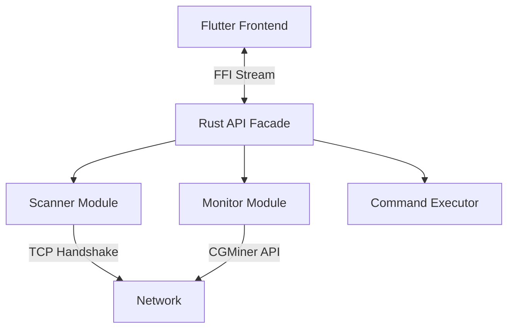
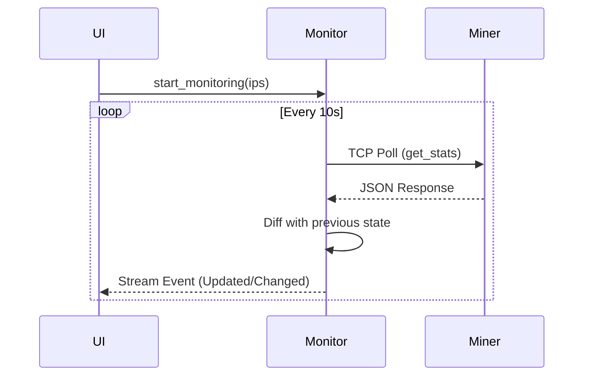

# Technical Design: "Bit-Link" Miner Manager

## 1. System Architecture
The application uses a **Split Architecture**: Rust for high-performance backend logic, and Flutter for the UI. Communication is handled via `flutter_rust_bridge`.

### High-Level Components

---

## 2. Code Map
This table defines the responsibility of each module in the codebase.

| Path | Module | Responsibility |
| :--- | :--- | :--- |
| **Backend** | | |
| `backend/src/api/` | **Facade** | The FFI boundary. Only functions here are exposed to Dart. |
| `backend/src/scanner/` | **Discovery** | Logic for `scan_range`. Manages thread pool & semaphores. |
| `backend/src/monitor/` | **State** | The polling loop. Maintains `DashMap<IP, MinerStats>`. |
| `backend/src/client/` | **Protocol** | `CGMinerClient`. Handshakes, JSON parsing, error handling. |
| `backend/src/core/` | **Domain** | Shared types: `Miner`, `MinerStats`, `MinerStatus`. |
| **Frontend** | | |
| `frontend/lib/src/rust/` | **Bridge** | Auto-generated FFI code (Do not edit manually). |
| `frontend/lib/src/widgets/` | **UI** | Reusable components (`MinerDataTable`, `Sidebar`). |
| `frontend/lib/src/services/` | **Logic** | Client-side persistence (`Credentials`, `IpRanges`). |

---

## 3. Core Data Structures (`backend/src/core/mod.rs`)

### 3.1 `Miner`
Represents the **identity** of a device.
*   **ip**: `String` (Unique Key)
*   **mac**: `Option<String>`
*   **model**: `String` (e.g., "S19 Pro")

### 3.2 `MinerStats`
Represents the **telemetry** of a device at a specific point in time.
*   **hashrate_rt**: `f64` (Real-time 5s average)
*   **hashrate_avg**: `f64` (Session average)
*   **temp_outlet_min/max**: `Vec<Option<f64>>` (Outlet/Chip temperatures)
*   **temp_inlet_min/max**: `Vec<Option<f64>>` (Inlet/PCB temperatures)
*   **fan_speeds**: `Vec<Option<u32>>` (RPMs)
*   **pools**: `Vec<PoolConfig>` (Active stratum URLs) - *Note: implementation uses explicit fields pool1/worker1 etc.*
*   **firmware**: `Option<String>`
*   **software**: `Option<String>`
*   **hardware**: `Option<String>`

### 3.3 `MinerStatus` (Enum)
Logic for classifying device health:
*   **Active**: `Hashrate > Limit` && `Temp < Limit`
*   **Warning**: Performance degraded.
*   **Offline**: Connection refused / Timeout.
*   **Scanning**: Initial discovery phase.

---

## 4. System Flows

### 4.1 Network Discovery (Scan)
**Module:** `backend/src/scanner/mod.rs`

1.  **Input**: Range (e.g., `192.168.1.0/24`) -> expands to 254 IPs.
2.  **Semaphore**: Acquires a permit from `Arc<Semaphore>` (Limit: 100) to control concurrency.
3.  **Task**: Spawns `tokio::task` for each IP.
4.  **Handshake**: Attempts TCP connect to port `4028`.
    *   If Success -> `Client::get_summary()` -> Return `Miner`.
    *   If Fail -> Drop.
5.  **Collector**: Results are streamed back to the UI or collected into a `Vec<Miner>`.

### 4.2 Monitoring Loop
**Module:** `backend/src/monitor/mod.rs`

### 4.3 Staggered Batch Execution
**Module:** `backend/src/api/commands.rs` (Implementation concept)

Goal: Execute a command on N miners without tripping breakers.
1.  **Queue**: Receives `Vec<IP>` and `Command`.
2.  **Batching**: Slices IPs into chunks of `BatchSize` (User Config).
3.  **Loop**:
    *   Execute chunk concurrently (`join_all`).
    *   `sleep(DelaySeconds)`.
    *   Report progress callback to UI.

---

## 5. FFI Boundary (Rust -> Dart)
These functions in `backend/src/api/` are the **only** entry points for the UI.

1.  `start_scan(range: String) -> Stream<ScanEvent>`
2.  `stop_scan()`
3.  `start_monitoring(ips: Vec<String>) -> Stream<MonitorEvent>`
4.  `stop_monitoring()`
5.  `execute_command(ips: Vec<String>, cmd: MinerCommand, delay: u64, batch_size: usize)`
6.  `detect_local_ranges() -> Vec<String>`

---

## 6. Implementation Guidelines
*   **No "Business Logic" in UI**: The Flutter side should be a dumb renderer. State decisions (e.g., "Is this miner overheated?") happen in Rust (`MinerStatus::from_stats`).
*   **Error Handling**: Rust errors (`anyhow::Result`) are mapped to FFI enums so Flutter can show distinct toasts (NetworkError vs AuthError).

---

## Appendix A: Protocol Implementation Details
**Critical Knowledge for Rebuilding the Client Module (`backend/src/client/mod.rs`)**

### A.1 CGMiner API Quirks
*   **Port**: Default is `4028`.
*   **Request Format**: `{"command": "summary", "parameter": ""}`.
*   **Response Handling**:
    *   **Trailing Garbage**: Miners often send null bytes (`\0`) or whitespace after the JSON. The parser **MUST** trim these characters before passing to `serde_json` or implement a "find last `}`" logic.

### A.2 parsing Variability
Different manufacturers return different JSON keys for the same data. The client must try them in order:

| Metric | Primary Key (Antminer) | Fallback Key (Whatsminer/Other) | Unit Logic |
| :--- | :--- | :--- | :--- |
| **Hashrate (Avg)** | `SUMMARY[0].MHS av` | `SUMMARY[0].GHS av` | Scale to **TH/s** (MHS / 1M, GHS / 1k). |
| **Hashrate (RT)** | `SUMMARY[0].GHS 5s` | `SUMMARY[0].HS 5s` | `HS 5s` may be a string ("13.5T"); needs regex parsing. |
| **Temperatures** | `STATS[0].temp_chip` | `STATS[0].temp` | Can be list of floats OR string "45-50-60". **Take MAX**. |
| **Fans** | `STATS[0].fanX` | | Collect all `fan[0-9]` keys. Filter 0 RPM. |

### A.3 MAC Address Retrieval
Since the API does not return MAC addresses, the system **MUST** query the OS ARP table (`arp -n` on macOS/Linux) after a successful connection to resolve the IP to a MAC address.
