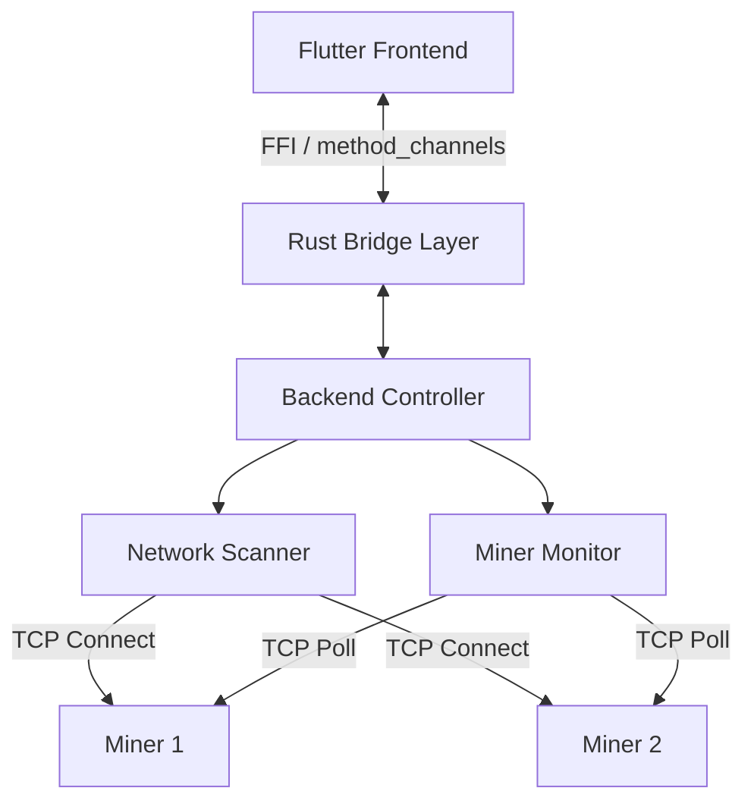

# Technical Design Document: "Bit-Link" Miner Manager

## 1. Architecture Overview

The system follows a split architecture to leverage the best of both worlds: **Rust** for high-performance, concurrent backend logic, and **Flutter** for a distinct, reactive cross-platform UI.

### High-Level Diagram


## 2. Technology Stack

### Backend (The "Engine")
*   **Language:** Rust (Edition 2021)
*   **Async Runtime:** `tokio` (for non-blocking I/O and scheduling)
*   **Serialization:** `serde` + `serde_json` (for parsing CGMiner RPC responses)
*   **Interoperability:** `flutter_rust_bridge` (v2 recommended) for type-safe, zero-copy communication with Flutter.

### Frontend (The "Cockpit")
*   **Framework:** Flutter (MacOS/Windows/Linux)
*   **State Management:** Riverpod (via generated FFI bindings)
*   **Key Widgets:**
    *   `MinerListView` - DataTable with sortable columns
    *   `ScannerControlPanel` - IP range input and scan trigger
    *   `MinerDetailDialog` - Expanded view for individual miner
    *   `BatchActionBar` - Multi-select actions (reboot, blink)
*   **Responsive Design:** Adaptive layout for desktop window resizing (minimum 1024x768)

## 3. Rust Module Design

The Rust codebase (crate: `rust_lib_frontend`) is organized into distinct modules. For full implementation details, refer to the source code links.

### Module Dependency Graph

```text
    +-----------------------------------------------------------+
    |                      api (Facade)                         |
    |  - Exposes: start_scan, start_monitoring                  |
    +------------------------+----------------------------------+
                             |
           +-----------------v-----------------+
           |                                   |
+----------v----------+             +----------v----------+
|      scanner        |             |      monitor        |
| - IP Range Scanning |             | - State Management  |
| - Discovery Stream  |             | - Polling Loop      |
+----------+----------+             +----------+----------+
           |                                   |
           +-----------------v-----------------+
                             |
             +---------------v---------------+
             |            client             |
             | - CGMiner Protocol Impl       |
             | - TCP / Socket Communication  |
             +---------------+---------------+
                             |
                  +----------v----------+
                  |        core         |
                  | - Domain Models     |
                  +---------------------+
```

### 3.1 `core`
**Responsibility:** Shared data models and domain types used across the application.

**Key Types:**
*   **`Miner`** ([backend/src/core/mod.rs](../backend/src/core/mod.rs)): Represents a mining device.
    *   Input: IP address, discovery metadata.
    *   Output: Aggregated device state (model, stats, status).
*   **`MinerStats`**: Real-time metrics and detailed device info.
    *   **Metrics:** `hashrate_rt` (5s avg), `hashrate_avg` (session avg), `temperature_chip` (all chips), `temperature_pcb` (all boards), `fan_speeds`, `uptime`.
    *   **Configuration:** `pool1`..`pool3`, `worker1`..`worker3` (Top 3 pools/workers).
    *   **System:** `firmware` (Version/Date), `software` (Miner implementation), `hardware` (Physical model), `mac_address`.
*   **`MinerStatus`**: logic for health classification.
    *   `Active`: Responding + temp < 85°C + hashrate > 90% expected.
    *   `Warning`: Use for degraded performance.
    *   `Dead`: Connection timeout.
    *   `Scanning`: Discovery phase.

### 3.2 `scanner`
**Responsibility:** Network device discovery.

**Behavior:**
*   **Input:** IP Range (CIDR or Start-End).
*   **Logic:** Spawns lightweight `tokio::task`s for each IP to attempt TCP handshake on port 4028.
*   **Concurrency:** Uses a semaphore to limit concurrent open file descriptors (batch processing).
*   **Output:** Stream of found devices.
*   **Enhanced Parsing:** The scanner/monitor now intelligently chains multiple commands (`summary`, `stats`, `pools`, `version`) to build a complete device profile, handling model-specific quirks (e.g., Antminer vs Whatsminer hashrate formats).
*   **Local Auto-Detection:** Enumerates local network interfaces to automatically suggest scan ranges using the `network-interface` crate.

**Source:** [backend/src/scanner/mod.rs](../backend/src/scanner/mod.rs)

### 3.3 `client` (Miner Communication)
**Responsibility:** Encapsulates the CGMiner / BMiner API protocol.

**Interface Contract (Trait):**
The `MinerClient` trait defines the standard operations for any miner model.

```rust
#[async_trait]
pub trait MinerClient {
    /// Fetch current metrics (hashrate, temps, etc.)
    async fn get_summary(&self) -> Result<MinerStats, Error>;
    
    /// Restart the device
    async fn reboot(&self) -> Result<(), Error>;
    
    /// Identify device physically
    async fn blink_led(&self) -> Result<(), Error>;
}
```

**Source:** [backend/src/client/mod.rs](../backend/src/client/mod.rs)

### 3.4 `monitor`
**Responsibility:** Manages the lifecycle of known miners.

**Behavior:**
*   **Loop:** Maintains a list of active IPs and polls them at a configurable interval.
*   **State:** Holds a concurrent hash map (`DashMap`) of the latest miner states.
*   **Broadcasting:** Pushes state updates/diffs to the UI via the bridge.

**Source:** [backend/src/monitor/mod.rs](../backend/src/monitor/mod.rs)

### 3.5 `api` (High-Level Interface)
**Responsibility:** Facade layer for the Flutter bridge. Wraps core functionality into cohesive, FFI-friendly APIs.

**Key Components:**
*   **`scanner`**: Orchestrates `scan_range`, collecting stream events into a final `Vec<Miner>` result for simple frontend consumption.
*   **`monitor`**: Manages global state of monitored miners (`CURRENT_MINERS`) and exposes a simplified `start_monitoring` command.
*   **`commands`**: Implements `execute_batch_command` for parallel control operations.

**Source:** [backend/src/api/mod.rs](../backend/src/api/mod.rs)

### 3.6 `scanner` (Scan Progress) [NOT IMPLEMENTED]
To support real-time progress bars in the UI, the scanner module needs to expose atomic counters.

**Proposed Implementation:**
```rust
static SCAN_PROGRESS_FOUND: AtomicU32 = AtomicU32::new(0);
static SCAN_PROGRESS_TOTAL: AtomicU32 = AtomicU32::new(0);
pub fn get_scan_progress() -> (u32, u32, bool) { ... }
```

## 4. Flutter UI Components

The frontend uses a dashboard layout with a collapsible sidebar and a central data table, built with reusable widgets consuming Rust FFI streams.

### Component Structure

```text
    +-----------------------------------------------------------+
    |                    HeaderBar (Top)                        |
    | (Sidebar Toggle | Title | Online/Total Stats | Settings)  |
    +-----------------------------------------------------------+
    |           |                                               |
    |  Sidebar  |             Main Content Area                 |
    |  (Left)   |                                               |
    |           |    +-------------------------------------+    |
    | Sections: |    |           ActionBar (Top)           |    |
    | - Scan    |    | (Scan/Monitor | Reboot | Locate)    |    |
    | - Pools   |    +-------------------------------------+    |
    | - Power   |    |                                     |    |
    |           |    |           MinerDataTable            |    |
    |           |    |     (Sortable, Multi-select,        |    |
    |           |    |      Comprehensive Columns)         |    |
    |           |    |                                     |    |
    |           |    +-------------------------------------+    |
    |           |    |        Footer (Pagination)          |    |
    +-----------+----+-------------------------------------+----+
```

### 4.1 `MinerDataTable` (Main Screen)
**Purpose:** Displays comprehensive metrics for all discovered miners in a dense, interactive table.

**Behavior:**
*   **Columns:** Status, IP, MAC, Model, Hashrate (RT/Avg), Temps (Max), Fan Speeds, Uptime, Pools/Workers, Firmware/Hardware.
*   **Features:**
    *   **Sorting:** All columns are sortable.
    *   **Selection:** Multi-select checkboxes for batch operations.
    *   **Interaction:** Tapping a row launches the miner's web interface (automatically handling HTTP Digest Auth).
    *   **Footer:** Pagination controls and selection summaries.

**Source:** `frontend/lib/src/widgets/miner_data_table.dart`

### 4.2 `Sidebar`
**Purpose:** Contains configuration and control panels organized into collapsible sections.

**Source:** `frontend/lib/src/widgets/sidebar/`

#### 4.2.1 `IPRangesSection`
*   **Function:** Input for defining scan targets (CIDR or "start-end" ranges).
*   **Auto-Detect:** "Auto" button triggers `detect_local_ranges()` to automatically discover and populate local network subnets, eliminating manual entry.

#### 4.2.2 `PoolConfigSection`
*   **Function:** Batch configuration for up to 3 mining pools.
*   **Features:** Includes "Worker Suffix" logic (`IP`, `No Change`, `Empty`) to automatically format worker names based on the miner's IP.

#### 4.2.3 `PowerControlSection`
*   **Function:** Quick access to power commands (Reboot, Sleep) for selected miners.

### 4.3 `ActionBar`
**Purpose:** Top toolbar for global monitoring and batch actions.

**Behavior:**
*   **Global Controls:**
    *   **Scan Network:** Triggers the discovery process.
    *   **Monitor:** Toggles the background polling loop.
*   **Batch Actions:**
    *   **Reboot Selected:** Opens a configuration dialog offering:
        *   **Staggered Reboot:** Executes in batches with a configurable delay. Shows a progress dialog with live status (success/fail counts) and a countdown timer.
        *   **Reboot at Once:** Immediate execution for all selected miners.
    *   **Locate (Blink):** Toggles the LED blinking state on selected miners for physical identification (provides visual feedback in UI).

**Source:** `frontend/lib/src/widgets/action_bar.dart`

### 4.4 `HeaderBar`
**Purpose:** Displays global application status and navigation controls.

**Display:**
*   **Stats:** Live counts for Online/Total miners and Total Network Hashrate.
*   **Controls:** Sidebar toggle, Theme toggle (Light/Dark), and Settings access.

**Source:** `frontend/lib/src/widgets/header_bar.dart`

### 4.5 Services
**Purpose:** Handle data persistence and business logic separation from UI widgets.

*   **`CredentialsService`**: Manages secure storage of miner SSH credentials (username/password) using `shared_preferences`.
*   **`IpRangeService`**: Persists user-defined IP scan ranges.
*   **`BatchSettingsService`**: Saves last-used configurations for staggered batch execution (batch size, delay interval).

**Source:** `frontend/lib/src/services/`

## 5. CGMiner API Protocol Detail

Communication is done by sending a JSON payload over a raw TCP socket.

**Request Format:** `{"command": "summary", "parameter": ""}`

**Response Contract:**
Miners return a JSON object with a `STATUS` array and a data array (e.g., `SUMMARY`).
*   **Edge Cases:** Antminer vs Whatsminer key differences ("MHS av" vs "HS 5s"), non-standard ports (4029/4030).

## 6. Interface Layer (Flutter Bridge)

We use `flutter_rust_bridge` to generate binding code. The `backend/src/api` module defines the **API boundary** between the UI and the Rust backend.

### Exposed Functions (Rust -> Dart)

These functions are defined in the `backend/src/api` module:

1.  **`start_scan`**
    *   **Input:** `ip_range: String` (CIDR or "start-end")
    *   **Output:** `Vec<Miner>` (Waits for scan completion and returns all discovered miners)

2.  **`start_monitoring`** (Stateful)
    *   **Input:** `ips: Vec<String>`
    *   **Output:** `()` (Starts background polling loop; updates are accessible via `get_current_miners`)

3.  **`execute_batch_command`**
    *   **Input:** `target_ips: Vec<String>`, `command: MinerCommand`
4.  **`detect_local_ranges`**
    *   **Input:** `()`
    *   **Output:** `Vec<String>` (Returns list of local `/24` subnets, e.g., `["192.168.1.1-192.168.1.254"]`)

## 7. Implementation Strategy

1.  **Basic TCP Client:** Implement `client` module to handshake and parse JSON.
2.  **The Scanner:** Implement `scanner` with `tokio::spawn` and timeouts.
3.  **State Management:** Implement `monitor` loop (poll, update, broadcast).
4.  **Integration:** Wire up `flutter_rust_bridge` to run Rust logic from Flutter.

## 8. Performance Considerations

*   **Socket Limits:** Scanner must respect `ulimit -n` (batch requests).
*   **Parsing Overhead:** Use `serde_json::from_slice` for efficiency.
*   **Target:** Scan 254 IPs in <10s (Requires ~100 concurrent connections).

## 9. Error Handling Strategy

**Error Categories:**
*   **Timeout:** Connection unavailable.
*   **ParseError:** Invalid JSON from miner.
*   **NetworkError:** IO failures.
*   **Authentication:** 401/403 errors (S19+ models).

**Propagation:**
*   **Rust → Flutter:** Errors are serialized as structured data via FFI.
*   **UI:** Toast notifications for transient errors, dialogs for critical failures.

## 10. Configuration Management

**Key Configuration Parameters:**
*   **Network:** `scan_timeout_ms` (Default: 2500ms), `max_concurrent_scans` (Default: 100).
*   **Monitoring:** `poll_interval_ms` (Default: 10s), `retry_attempts`.
*   **Thresholds:** `warning_temp_threshold` (85°C), `warning_hashrate_ratio` (90%).

**Storage:** User preferences saved to `~/.bitlink/config.json`.

## 11. Observability & Debugging

*   **Logging:** `tracing` crate (ERROR, WARN, INFO, DEBUG).
*   **Metrics:** Scan duration, active connections, success rates exposed via FFI.

## 12. Testing Strategy

*   **Unit Tests:** Mock TCP responses for `client` and `scanner`.
*   **Integration Tests:** End-to-end scan against mock miner servers.
*   **Manual Testing:** `docker-compose` virtual network with simulated miners.

## 13. Platform Specifics (macOS)

*   **App Sandbox:** Flutter apps on macOS run in a sandbox by default.
*   **Entitlements:** The `com.apple.security.network.client` entitlement is **required** in `DebugProfile.entitlements` and `Release.entitlements` to allow the scanner to make outgoing TCP connections.

## 14. Future Enhancements

*   **Data Persistence:** SQLite for historical trends.
*   **Alerts:** Desktop notifications.
*   **Bulk Config:** Pool configuration updates.
*   **Remote Access:** WebSocket control.


## 15. Implementation Priority (Revised)

| Order | Feature | Status |
| :---: | :--- | :--- |
| 1 | Color-coded row backgrounds | **Implemented** |
| 2 | Status bar | **Implemented** |
| 3 | Column sorting | **Implemented** |
| 4 | Collapsible scanner panel | **Partially Implemented** |
| 5 | Search & filter bar | **Pending** |
| 6 | Staggered batch execution | **Implemented** |
| 7 | Scan progress | **Pending** |
| 8 | Sticky column headers | **Pending** |
| 9 | Wide data grid polish | **Partially Implemented** |
